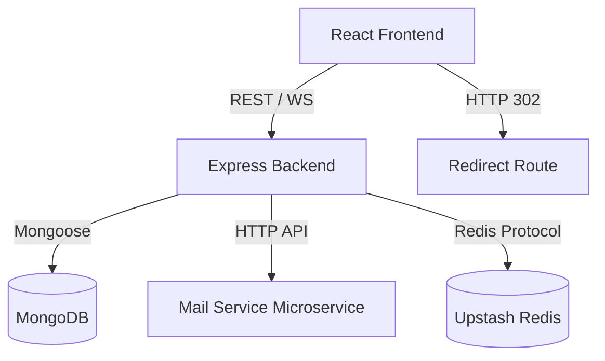
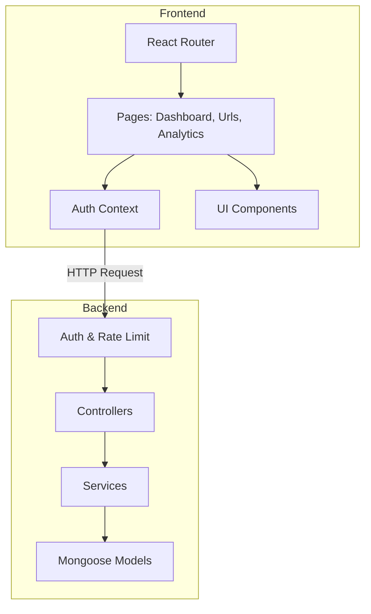
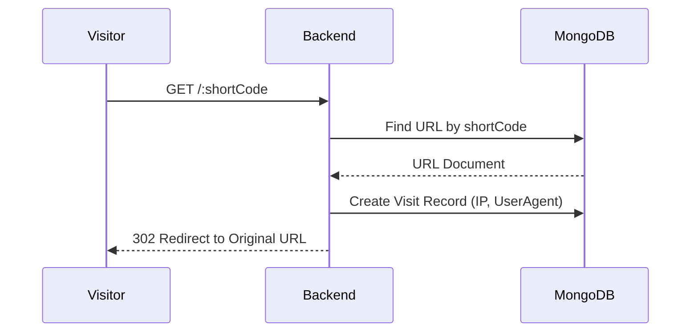

# DemoApplication (URL Shortener)

## 1. Project Overview

* **Project Name**: DemoApplication (URL Shortener)
* **Short Description**: A full-stack web application for creating, managing, and tracking shortened URLs with real-time analytics and QR code generation.
* **Problem Being Solved**: Long, unwieldy URLs are difficult to share, track, and manage. Users need a reliable tool to shorten links, generate QR codes for offline sharing, and analyze traffic to those links in real-time.
* **Target Users**: Marketers, social media managers, content creators, and everyday users who need to share clean links and track engagement.
* **Value Proposition**: Offers a streamlined interface to manage URLs, bulk upload links, view detailed analytics (browser, device, location), and instantly generate QR codes, all backed by a secure and scalable architecture.
* **Key Objectives**:
  * Provide fast and reliable URL redirection.
  * Deliver detailed, real-time analytics for link clicks.
  * Ensure secure user authentication with email verification.
  * Allow seamless bulk link creation via CSV.

---

## 2. AI Planning Document

### Problem Statement
The application solves the problem of tracking link engagement and sharing clean URLs across digital and physical mediums (via QR codes).

### Business Goal
To provide a robust link management platform that increases user productivity and provides actionable insights into audience behavior.

### User Personas
* **Marketing Professional**: Needs to track campaign performance, bulk generate links, and monitor geographic and device analytics.
* **Content Creator**: Wants clean links for social media bios and QR codes for physical merchandise or videos.

### User Journey
1. **Onboarding**: User registers with an email and password, receives a verification OTP via the mail-service, and verifies their account.
2. **Dashboard**: User logs in and lands on the dashboard, viewing global analytics and recent URLs.
3. **Link Creation**: User creates a new short URL, optionally providing a custom alias. Alternatively, the user uploads a CSV for bulk creation.
4. **Distribution**: User copies the short link or downloads the QR code to share.
5. **Tracking**: As users click the link, real-time analytics (via Socket.io) update on the dashboard, detailing IP, country, device, and browser.

### Functional Requirements
* User Registration, Login, and Password Reset (with OTP).
* Email verification via dedicated Mail Service.
* Create, Read, Update, and Delete (CRUD) operations for URLs.
* Custom alias support for shortened URLs.
* Bulk URL upload via CSV.
* QR Code generation for each URL.
* Redirection from short code to original URL.
* Analytics tracking per click (IP, User-Agent parsing, geolocation).
* Real-time dashboard updates using WebSockets.

### Non-Functional Requirements
* **Performance**: Redis caching (Upstash) and fast redirection logic.
* **Scalability**: Microservice architecture for email delivery, scalable Node.js/Express backend.
* **Security**: JWT authentication, bcrypt password hashing, helmet, express-rate-limit, CORS configuration.
* **Reliability**: MongoDB for persistent storage, robust error handling.
* **Maintainability**: Clear separation of concerns (Routes, Controllers, Services, Models), React Context for state management.

### Risks and Constraints
* **Risk**: High volume of clicks could bottleneck the database. **Mitigation**: Implement caching and batch writes for analytics.
* **Constraint**: Rate limits on external APIs (like GeoIP if external) or Redis limitations.

### Future Enhancements
* Implement link expiration dates and password-protected links.
* Add organization/team accounts for shared link management.
* Custom domain support for branded short links.

---

## 3. Complete Feature Documentation

### Authentication
* **Feature Name**: User Registration & Login
* **Purpose**: Secure user access to the platform.
* **User Benefit**: Protects user data and personalized analytics.
* **Technical Implementation Summary**: Implemented using JWT for session management and bcrypt for password hashing. Includes OTP-based email verification and password reset flows using a dedicated Node.js mail service.

### Dashboard
* **Feature Name**: Real-time Analytics Dashboard
* **Purpose**: Overview of user's link performance.
* **User Benefit**: Immediate insight into total clicks and active URLs.
* **Technical Implementation Summary**: React frontend consuming REST APIs, supplemented with Socket.io for real-time click updates. Recharts is used for data visualization.

### Data Management
* **Feature Name**: URL Management (CRUD & Bulk Upload)
* **Purpose**: Create and manage shortened links.
* **User Benefit**: Flexibility to create single links with custom aliases or upload multiple links via CSV.
* **Technical Implementation Summary**: Node.js backend endpoints for single and bulk creation (using `papaparse` on the frontend). MongoDB stores URL metadata and generates unique short codes using `nanoid`.

### Analytics
* **Feature Name**: Click Tracking & Geolocation
* **Purpose**: Gather detailed data on link visitors.
* **User Benefit**: Understand audience demographics (device, browser, location).
* **Technical Implementation Summary**: The redirect route captures the request, parses the User-Agent using `useragent`, resolves the IP to a location using `geoip-lite`, and logs a `Visit` record in MongoDB.

### Settings
* **Feature Name**: User Profile & Security Settings
* **Purpose**: Manage account details.
* **User Benefit**: Ability to change passwords and update profile information.
* **Technical Implementation Summary**: Frontend forms interacting with authenticated backend endpoints.

---

## 4. Technical Architecture Documentation

### High-Level Architecture
The application follows a standard MERN-stack architecture with an additional microservice for email handling. The React frontend communicates with the Express backend via REST APIs and WebSockets. The backend interacts with MongoDB for data persistence and a Redis instance for rate-limiting/caching.

### Frontend Architecture
* Single Page Application (SPA) built with React and Vite.
* State management using React Context (`AuthContext`).
* Routing handled by `react-router-dom` with protected routes.
* Styling via TailwindCSS.

### Backend Architecture
* Monolithic Node.js/Express core application.
* Layered architecture: Routes -> Middleware (Auth/Validation) -> Controllers -> Services -> Database Models.
* Real-time communication via Socket.io.

### Database Architecture
* MongoDB (NoSQL) with Mongoose ODM.
* Collections: `Users`, `Urls`, `Visits`.
* Relational linking via `ObjectId` (e.g., `Url` belongs to `User`, `Visit` belongs to `Url`).

### Third-Party Services
* Upstash Redis (for caching/rate limiting).
* Resend (potentially configured for emails, though a custom mail-service is used).

### External APIs
* Custom Mail Service running on a separate port (e.g., `http://localhost:5001`).

### Infrastructure Components
* Node.js runtime environments.
* MongoDB Atlas or local MongoDB instance.
* Redis server.

### Authentication Flow
1. User submits credentials.
2. Backend verifies hash and generates JWT.
3. JWT is returned to the client and stored (memory/local storage).
4. Subsequent requests include JWT in the Authorization header.

### Data Flow
1. Client requests shortened URL creation.
2. Backend validates data, generates short code, and saves to MongoDB.
3. Backend returns new URL data.
4. User visits short code -> Redirect Controller intercepts -> Logs Visit -> 302 Redirect to Original URL.

#### System Architecture Diagram



#### Component Diagram



#### Sequence Diagram (URL Redirection & Tracking)



---

## 5. Tech Stack Documentation

### Frontend Technologies

| Technology | Purpose |
| ---------- | ------- |
| React 19 | UI Library for building the SPA |
| Vite | Frontend build tool and bundler |
| TailwindCSS | Utility-first CSS framework for styling |
| React Router | Client-side routing |
| Axios | HTTP client for API requests |
| Recharts | Data visualization for analytics |
| Socket.io-client | Real-time WebSocket communication |
| Framer Motion | UI animations and transitions |

### Backend Technologies

| Technology | Purpose |
| ---------- | ------- |
| Node.js | Server runtime environment |
| Express.js | Web framework for routing and middleware |
| Socket.io | WebSocket server for real-time analytics |
| JWT & Bcrypt | Authentication and password hashing |
| Nanoid | Generating unique short codes |
| Geoip-lite | IP geolocation for analytics |
| Helmet & CORS | Security headers and Cross-Origin rules |

### Database Technologies

| Technology | Purpose |
| ---------- | ------- |
| MongoDB | Primary NoSQL database |
| Mongoose | Object Data Modeling (ODM) library |
| Upstash Redis | In-memory data store for caching/rate-limiting |

### DevOps and Deployment

| Technology | Purpose |
| ---------- | ------- |
| Docker | Containerization (backend has Dockerfile & compose) |
| Nodemon | Local development hot-reloading |
| Vercel | Configured for frontend/mail-service deployment (`vercel.json`) |

---

## 6. Folder Structure Documentation

```
DemoApplication/
├── backend/                  # Main Express Backend
│   ├── src/
│   │   ├── config/           # Database and Redis configurations
│   │   ├── controllers/      # Request handling logic (auth, url, analytics)
│   │   ├── middleware/       # Express middlewares (auth, validation)
│   │   ├── models/           # Mongoose schemas (User, Url, Visit)
│   │   ├── routes/           # API route definitions
│   │   ├── services/         # Business logic (email, url processing)
│   │   ├── utils/            # Helper functions
│   │   └── app.js            # Express app initialization
│   ├── Dockerfile            # Container configuration
│   └── docker-compose.yml    # Multi-container orchestration
├── frontend/                 # React SPA
│   ├── src/
│   │   ├── components/       # Reusable UI components (Modals, Loader)
│   │   ├── context/          # React Context (AuthContext)
│   │   ├── hooks/            # Custom React hooks
│   │   ├── layouts/          # Page layouts (AuthLayout, DashboardLayout)
│   │   ├── lib/              # Utility libraries
│   │   ├── pages/            # Route components (Dashboard, Login, Analytics)
│   │   ├── routes/           # Route definitions (ProtectedRoute)
│   │   └── services/         # API integration (axios instances)
│   ├── index.html            # Entry HTML
│   └── vite.config.js        # Vite configuration
├── mail-service/             # Email Microservice
│   ├── api/                  # Serverless/API endpoints for sending emails
│   └── package.json          # Dependencies (Express, Nodemailer)
└── README.md                 # Project Documentation
```

---

## 7. Setup Instructions

### Prerequisites
* Node.js (v18 or higher)
* MongoDB (Local instance or Atlas URI)
* Redis (Upstash or local)

### Clone Repository
```bash
git clone <repository-url>
cd DemoApplication
```

### Install Dependencies
Run the following in each of the three directories:
```bash
# Frontend
cd frontend
npm install

# Backend
cd ../backend
npm install

# Mail Service
cd ../mail-service
npm install
```

### Environment Variables

Provide a complete `.env.example` template based on detected environment variables. Create these files in their respective directories.

**backend/.env**
```env
PORT=5000
MONGODB_URI=mongodb://localhost:27017/url-shortener
JWT_SECRET=your_super_secret_jwt_key
FRONTEND_URL=http://localhost:5173
MAIL_SERVICE_URL=http://localhost:5001
MAIL_API_KEY=your_internal_microservice_api_key
REDIS_URL=redis://localhost:6379
```

**frontend/.env**
```env
VITE_API_URL=http://localhost:5000/api
```

**mail-service/.env**
```env
PORT=5001
SMTP_HOST=smtp.example.com
SMTP_PORT=587
SMTP_USER=your_email@example.com
SMTP_PASS=your_email_password
MAIL_API_KEY=your_internal_microservice_api_key
```

### Database Setup
Ensure MongoDB is running locally or provide a valid Atlas URI in the backend `.env` file. Collections will be created automatically by Mongoose upon initial insertion.

### Local Development
You can run the services concurrently or in separate terminals.

Terminal 1 (Backend):
```bash
cd backend
npm run dev
```

Terminal 2 (Mail Service):
```bash
cd mail-service
node ./api/index.js
```

Terminal 3 (Frontend):
```bash
cd frontend
npm run dev
```

### Build
To build the frontend for production:
```bash
cd frontend
npm run build
```

### Production Deployment
See the Deployment Documentation section below.

### Troubleshooting
* **CORS Errors**: Ensure `FRONTEND_URL` in the backend `.env` perfectly matches the URL you are accessing the frontend from.
* **Email not sending**: Verify `MAIL_API_KEY` matches between the backend and `mail-service`, and that SMTP credentials are correct.

---

## 8. Assumptions Made

* **Technical assumptions**: Assumed that the mail-service is intended to run as a separate microservice and communicate via HTTP API using an internal API key.
* **Business assumptions**: The application is intended for public use, requiring robust rate limiting and email verification to prevent abuse.
* **Deployment assumptions**: The presence of `vercel.json` and a `Dockerfile` indicates a hybrid deployment strategy (e.g., Frontend/Mail-service on Vercel, Backend on a container platform like Docker/Render).

---

## 9. API Documentation

| Method | Route | Purpose | Request Body | Response | Auth Required |
| :--- | :--- | :--- | :--- | :--- | :--- |
| POST | `/api/auth/register` | Register a new user | `{ name, email, password }` | `{ message, userId }` | No |
| POST | `/api/auth/login` | Authenticate user | `{ email, password }` | `{ token, user }` | No |
| GET | `/api/auth/me` | Get current user profile | None | `{ user }` | Yes |
| POST | `/api/urls` | Create short URL | `{ originalUrl, customAlias }` | `{ url }` | Yes |
| POST | `/api/urls/bulk` | Create multiple URLs | `[{ originalUrl, customAlias }]` | `{ urls }` | Yes |
| GET | `/api/urls` | List user's URLs | None | `[ { url } ]` | Yes |
| GET | `/api/urls/:id` | Get single URL | None | `{ url }` | Yes |
| DELETE | `/api/urls/:id` | Delete a URL | None | `{ message }` | Yes |
| GET | `/api/analytics/global` | Get global user analytics| None | `{ totalClicks, topLocations... }` | Yes |
| GET | `/:shortCode` | Redirect to original URL | None | `302 Redirect` | No |

---

## 10. Security Documentation

* **Authentication**: Implemented using JSON Web Tokens (JWT) signed with a secure secret.
* **Authorization**: Middleware (`requireAuth`) ensures users can only access and modify their own URLs and analytics data.
* **Data Protection**: Passwords are cryptographically hashed using `bcrypt` before database storage.
* **Secrets Management**: Sensitive keys and database URIs are managed via `.env` variables and are not committed to version control.
* **Input Validation**: Handled by custom validators (likely utilizing tools/manual checks within the controllers) to ensure valid URL formats and prevent NoSQL injection.
* **Rate Limiting**: `express-rate-limit` is applied to API routes to mitigate DDoS and brute-force attacks (100 requests per 15 minutes).

---

## 11. Deployment Documentation

### Vercel
The frontend and mail-service can be easily deployed to Vercel, as indicated by the included `vercel.json` files.
1. Connect the GitHub repository to Vercel.
2. For the frontend project, set the Root Directory to `frontend`. Environment variable: `VITE_API_URL`.
3. For the mail-service, set the Root Directory to `mail-service` and deploy as Serverless Functions.

### Render / Railway (Backend)
The Node.js backend is well-suited for platforms like Render or Railway.
1. Create a new Web Service pointing to the repository.
2. Set the Root Directory to `backend`.
3. Build Command: `npm install`
4. Start Command: `npm start`
5. Configure all necessary Environment Variables (MongoDB URI, JWT Secret, Frontend URL).

---

## 12. README.md Generation
*(This document itself serves as the complete README.md containing all required sections.)*

---

## 13. Hackathon Compliance Check

- [x] Planning Section
- [x] Feature Documentation
- [x] Architecture Diagram
- [x] Setup Instructions
- [x] Assumptions
- [x] README Content
- [x] Demo Video Placeholder: [Insert Demo Video Link Here]

---

## 14. Mandatory Footer

This project is a part of a hackathon run by https://katomaran.com


## 15. Video Link

Explanatory Video Link of this application: https://www.loom.com/share/5945d3b2d5f043e1a3b55e307f541467